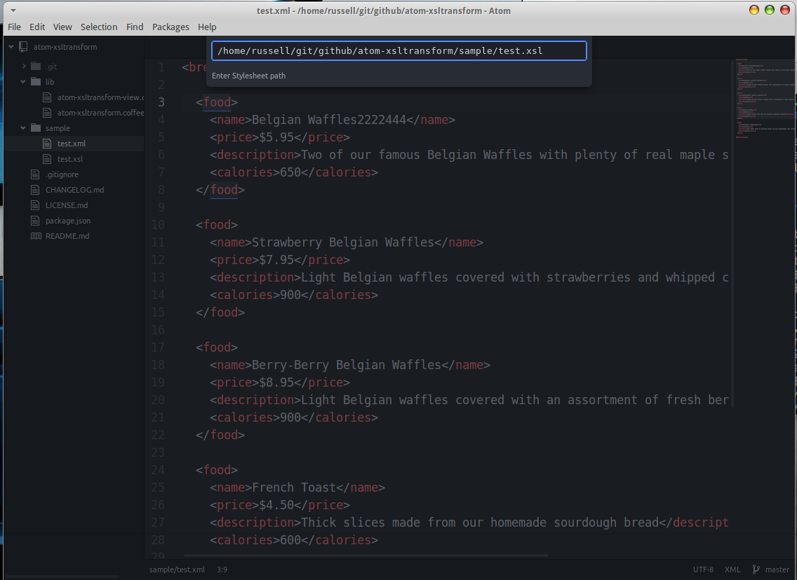
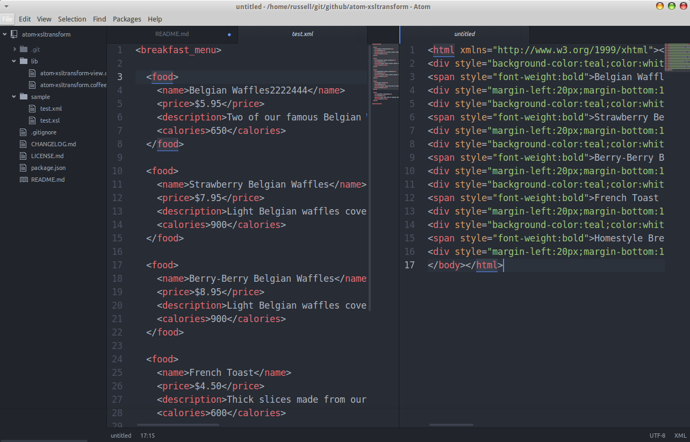

# atom-xsltransform package

Transform XML Documents using XSL Stylesheets.

This package uses JavaScript native XSLTProcessor, without any OS dependent tools.

To use:

* Open the XML file in Atom.
* CTRL-SHIFT-P "atom-xsltransform:transform-xml"
* Enter the path of the XSL stylesheet (default directory is same path as XML file)
* Click confirm
* New pane is opened to the right with the transformed XML.

